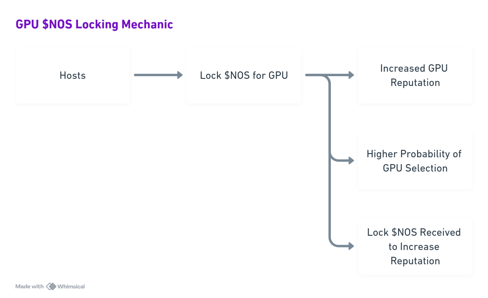
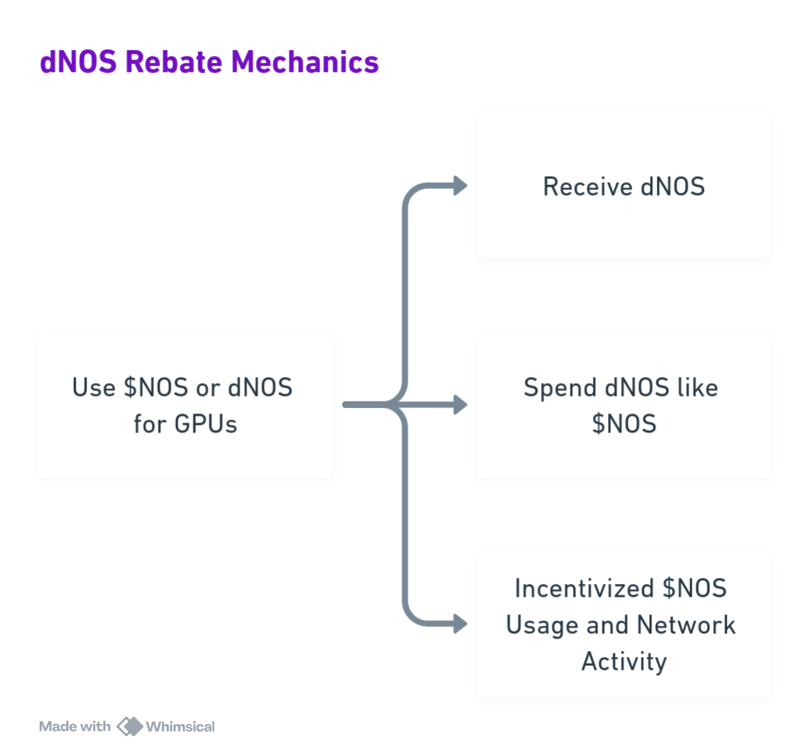

  
  

# NNP-0001: Tokenomics

*Dated: October 22, 2025*

---

## Table of Contents

- [1. Executive Summary](#1-executive-summary)
  - [1.1 Core changes (at a glance)](#11-core-changes-at-a-glance)
  - [1.2 Core changes (deferred)](#12-core-changes-deferred)
- [2. Background and Prior Pain Points](#2-background-and-prior-pain-points)
- [3. Design Principles](#3-design-principles)
- [4. Policy Recommendations](#4-policy-recommendations)
  - [4.1 Cost Indexed Minimum Stake for GPU Providers](#41-cost-indexed-minimum-stake-for-gpu-providers)
    - [4.1.1 Definitions](#411-definitions)
    - [4.1.2 Operational Rules](#412-operational-rules)
    - [4.1.3 Potential Impact](#413-potential-impact)
  - [4.2 Retargeted Emissions](#42-retargeted-emissions)
    - [4.2.1 Passive Staking Rewards (General Staking Pool)](#421-passive-staking-rewards-general-staking-pool)
    - [4.2.2 Host Base Incentive Rewards](#422-host-base-incentive-rewards)
      - [4.2.2.1 Definitions](#4221-definitions)
    - [4.2.3 dNOS Rebate Mechanics](#423-dnos-rebate-mechanics)
      - [4.2.3.1 Core Mechanics](#4231-core-mechanics)
      - [4.2.3.2 Operational Rules](#4232-operational-rules)
  - [4.3 Multi-Currency Payments](#43-multi-currency-payments)
  - [4.4 Reputation Engine & Fair Job Scheduler](#44-reputation-engine--fair-job-scheduler)
- [5. Economic Flywheel](#5-economic-flywheel)
  - [5.1 Supply Side](#51-supply-side)
  - [5.2 Demand Side](#52-demand-side)
- [6. Governance and Voting](#6-governance-and-voting)

---

## 1. Executive Summary

Nosana’s revised tokenomics retarget inflationary staking emissions toward productive GPU supply while introducing cost indexed staking collateral and keeping a much smaller passive pool for general stakers. In parallel, fee mechanics including $NOS rebates continue to convert usage into token demand. The destination is a $NOS‑powered model where emissions have a clear job and that is to pay for readiness and reliability, so the network can scale, retain users, and compound network effects.

### 1.1 Core changes (at a glance)

- **Cost-indexed minimum stake ($Smin$):** Each host locks collateral proportional to its advertised $/hr and policy horizon $H$, keeping skin in the game aligned with earning power.
- **Retargeted emissions:** Per-epoch inflation is split into Host Incentive Rewards, a Rebate/Grants pool and a passive staking pool.  Passive staking emissions are reduced over time and sunset after a 12 month period expires.
- **dNOS rebate loop:** Non‑transferable rebates for buyers that burn on redemption, driving repeat usage without adding to circulating supply.
- **Host reputation score:** Provides the basis for Host Incentive rewards, but in addition a higher score gives a host a higher probability of being selected for client work and, therefore, higher earnings.  Uptime/performance/quality of a host are dominant weight factors.

The goal of the core changes is to provide rewards that reinforce the network.  $NOS emissions pay for readiness and reliability of GPUs and to keep the supply on the network intact.  $NOS acts as the collateral, payment and yield to drive all the activity on the network.

### 1.2 Core changes (deferred)

The following changes have been discussed and will be presented as separate proposals (January 2026)

- **USDC Payments:** Clients can make their payments in USDC as well as FIAT, with increased fee collection, while driving the demand for $NOS.

- **Fair Job Scheduler:** To ensure a fair distribution of client submitted jobs so that one or few host operators cannot monopolise jobs, for jobs which are submitted without advanced GPU selection.

---

## 2. Background and Prior Pain Points

Nosana’s current incentive design pays out staking yield largely independent of real network usage. Any token holder can stake and earn ~20% APR, even if they do not supply GPU capacity or drive jobs. That means $NOS is regularly emitted without a clear link to throughput, reliability, or user value.

The scale of the mismatch is material. ~2.76 M $NOS was distributed to stakers over the recent period at an average price of ~$1.50, that is roughly $4.1 M in token rewards with no audit trail tying those emissions to measurable network contribution. Because eligibility is open-ended, much of this capital behaves mercenary staking to farm yield rather than to operate or consume the network.

This dynamic creates predictable outcomes:

- **Dilution without growth.** Mining‑style emissions expand supply while doing little to increase paid jobs or retention, pressuring price and confidence.
- **Decoupled utility.** $NOS accrues value to passive balances instead of the actors who make the marketplace useful.

On the supply side, the situation is fragile. GPUs are not required to post meaningful collateral, so operators can appear and disappear with minimal downside. Without per‑node/device stake, there is little skin in the game to deter spoofing, low‑effort setups, or spam registrations. The result is a higher incidence of flaky workers, queue churn, and a degraded buyer experience especially harmful in a marketplace where value depends on instant, reliable matching.

Finally, capacity providers are not properly incentivised to stay online. A GPU marketplace is only as good as the capacity it can match right now: deep, dependable supply shrinks wait times, stabilises prices, lifts job success, and unlocks enterprise demand. When rewards flow mainly to passive staking, the network under‑invests in the very readiness and reliability that create durable network effects.

In short, the present model subsidises idle capital over productive capacity. It dilutes holders, weakens supply‑side reliability, and slows the demand flywheel. The update that follows is designed to re‑attach rewards to usage and collateral, so emissions buy the two things the marketplace truly needs: availability and trust.

---

## 3. Design Principles

Our design goal is straightforward: pay for the behaviours that make the marketplace valuable for both buyers and suppliers and make the rules easy to verify.

1. Emissions must fund growth, not idle balances. Emitted $NOS is directed to eligible GPUs that provide capacity and meet SLAs. The passive host staking pool is intentionally small and can taper as fee share grows, so APR isn’t propped up by dilution.
2. Bigger or pricier GPUs lock more $NOS via cost‑indexed Smin, creating real skin‑in‑the‑game, raising Sybil cost, and anchoring service quality and availability.
3. Reward service, not promises. Reputation scores based on factors like uptime, performance, and quality is the primary driver of rewards. Doing better directly translates into higher earnings, failing SLAs reduces weight or makes a node ineligible for rewards or to remain on the network.
4. Incentivise a demand flywheel with rebates. $NOS/dNOS rebates make repeat usage cheaper, improve retention, and convert throughput into lasting token demand, pulling more supply online.
5. Keep the math boring and auditable. Few parameters, on‑chain metrics, and policy‑tunable constants. Every equation is transparent and easy for the community to verify and govern.

---

## 4. Policy Recommendations

### 4.1 Cost Indexed Minimum Stake for GPU Providers

Require each host $i$ to lock a minimum stake sized to its advertised hourly cost $C_i$ and a security horizon $H$ hours.  Minimum stake does not bear any APR.  This is replaced by the Host Base Incentive Rewards documented in Section 4.2.2

$$S_{min,i} = \beta \frac{C_{m(i)}}{P_{NOS}} H$$

#### 4.1.1 Definitions

- $S_{min,i}$: minimum stake required for device $i$ (in NOS)
- $C_{m(i)}$: host price based on its market (USD per hour)
- $P_{NOS}$: oracle price of NOS in USD
- $H$: collateral window in hours (e.g., 336–720 for 14–30 days)
- $\beta$: how much of that window’s gross revenue should be posted as collateral to determine the skin in the game.

#### 4.1.2 Operational Rules

$S_{min,i}$ moves with the NOS price; if a host falls below the minimum, the operator has a fixed-hour grace period, denoted by $G$, to top up before rewards pause (and/or the node becomes ineligible). Governance can adjust ‘$\beta$’ and ‘$H$’ as market conditions change (risk appetite, utilisation, token volatility).

#### 4.1.3 Potential Impact

Anchoring the minimum stake to a node’s quoted price per hour means collateral scales with earning power: faster, pricier GPUs must lock more NOS. That creates credible skin‑in‑the‑game and raises the cost of Sybil‑style spam, because every additional device needs its own bond. By dividing the bond by the on‑chain $NOS price, the requirement stays USD‑stable so operators aren’t under or over‑collateralised just because the token moves. As capacity and USD/hr quotes grow, more NOS is locked, forming a structural sink that lowers effective float. And because each device posts its own bond, low‑effort or spoofed workers face a real economic hurdle, which improves reliability and overall network quality for buyers.

Within the collateral window, existing hosts will, from time to time, either be under or over collateralised.  Logic will be introduced to allow hosts to either auto top-up their stake or to make partial withdrawals of their stake.

### 4.2 Retargeted Emissions

The $NOS emissions are now divided into three categories: Staking rewards for passive stakers, host base incentive rewards, and client usage rebates.

#### 4.2.1 Passive Staking Rewards (General Staking Pool)

To respect long‑term community stakers while ending value‑leakage, the general staking pool is capped at 720,000 $NOS for the next 12 months, streamed pro‑rata to opted‑in legacy xNOS. For the initial 6 month period, beginning November 29th, the general staking pool will be reduced linearly.  For the follow-on 6 month period, the general staking pool will remain at a static level for runoff and sunset.

- **Sunset:** After the 12 month period expires, the general staking pool decays to zero unless governance explicitly renews it with a data-backed proposal (e.g. fee coverage, retention impact).
- **Expected APR:** With ~14 M $NOS currently staked, after the initial 6 months of linear reductions this will equate to ≈ 4% APR. This APR figure assumes that all existing stakes remain in place.  The rate floats: if the base shrinks as holders rotate into GPU supply or unlock, APR rises modestly; if it grows, APR falls. The market will find a new equilibrium without requiring governance micro‑tuning.
- **New-stake warnings:** Effective November 29th ($T_0$), it will remain possible to enter a new stake or increase stake.  However, warnings will be placed on the staking UI to clearly inform any new stakers that APR is being reduced and that the passive staking pool will be retired on November 28, 2026.  This avoids trapping new entrants at a lower APR and accelerates migration to GPU staking.

Rationale: Historically, general staking acted as value leakage, emitting tokens to idle balances. By gradually reducing the general staking emissions, we honour long‑term holders while steering new emissions toward productive supply. The approach reduces dilution, lowers mercenary capital churn, and creates a clearer path to network growth.

The following table represents the general staking pool reductions by months, until the pool reaches equilibrium with our desired emissions per year.

| Pool # | Months | Pool Size ($NOS) |
|:------:|:------:|:-----------------:|
| **1**  |   1    |      198,569      |
| **2**  |   1    |      167,189      |
| **3**  |   1    |      135,808      |
| **4**  |   1    |      104,428      |
| **5**  |   1    |       73,047      |
| **6**  |   1    |       41,667      |
| **7**  |   1    |       41,667      |
| **8**  |   1    |       41,667      |
| **9**  |   1    |       41,667      |
| **10** |   1    |       41,667      |
| **11** |   1    |       41,667      |
| **12** |   1    |       41,667      |

Total Emissions made towards General Staking Rewards, for the forward looking 12 month period from the effective date of change will be 720.708 NOS.

#### 4.2.2 Host Base Incentive Rewards

Host base incentive rewards will be allocated to GPU Operators who bring GPUs online and keep them compliant.  Only hosts that (a) meet or exceed $S_{min,i}$ (Host stake), and (b) pass service level gates (uptime, performance, quality) can earn incentive rewards.  For the latter, we introduce a reputation score for GPU hosts.  The score compresses a host’s service quality into a single, comparable metric across GPU classes.

Base incentive rewards are market-aware: each GPU class (market) has its own $NOS/s price, and hosts inherit that price

Per epoch, a host will be eligible for fixed rewards which will accumulate and are claimable by the host at the end of the epoch.  There is a maximum incentive reward that any individual host can earn per epoch.  A maximum cap exists on the pool per epoch (Max Incentive Reward) that can be emitted in any epoch. If we are over the maximum cap, then an increase in eligible hosts reduces the maximum incentive reward per host. A decrease in eligible hosts increases the maximum incentive reward per host. If we are under the maximum cap the number of hosts does not affect the fixed rewards an individual host can earn.

##### 4.2.2.1 Definitions

We partition hosts into *markets* by GPU class. Each market $m$ has a price $\rho_m$ in NOS/second for jobs actually run in that market. Let $m(i)$ denote the market of host $i$.
Let an epoch have length $T$ seconds, and let $b \in (0,1)$ denote the *base–pay share*
relative to full utilization (e.g. $b=0.05$ pays 5% of what a host would earn if it ran jobs 100% of the epoch).

For a host $i$ we define:
- $U_i, P_i, Q_i \in [0,1]$: uptime, performance, and quality scores (post-SLA).
- $w_U,w_P,w_Q \ge 0$: weights for $(U,P,Q)$; setting a weight to $0$ disables that factor.
- $L_i$ and $S_{\min,i}$: locked stake and the minimum required stake for $i$'s class.
- $w_S \ge 0$: stake *boost* weight.
- $\alpha \in (0,1)$: exponent for diminishing returns on stake.
- $M_{\mathrm{total}}$: *global* maximum NOS emitted across all hosts per epoch.

**Derived variables:**
- $\bar{w} = w_U + w_P + w_Q$: sum of reputation weights.
- $R_i$: reputation score for host $i$.
- $S_i$: stake boost factor for host $i$.
- $B_i$: per-market base unit for host $i$.
- $\mathrm{Base}^{\mathrm{uncap}}_{i}$: uncapped base pay for host $i$.
- $\mathcal{N}$: set of eligible hosts (passing SLA gates).
- $C$: global cap factor (scaling factor).
- $\mathrm{Reward}_{i}$: final reward for host $i$ within the epoch.
- $\mathbf{1}\cdot\{\mathrm{SLA}_i\}$: SLA indicator function (1 if host meets SLA gates, 0 otherwise).

**Reputation score.**
Let $\bar{w} = w_U + w_P + w_Q$ and **assume** $\bar{w} > 0$.

$$R_i = \frac{w_U U_i + w_P P_i + w_Q Q_i}{\bar{w}}$$

*Uptime-only mode*: $w_U=1$, $w_P=w_Q=0$ $\Rightarrow$ $R_i = U_i$.

**Stake boost.**

$$S_i = 1 + w_S \left(\frac{L_i}{S_{\min,i}}\right)^{\alpha}$$

**Per-market base unit.**
Each host inherits its market price:

$$B_i = b \rho_{m(i)} T$$

**Uncapped per-host base pay.**

$$\mathrm{Base}^{\mathrm{uncap}}_{i} = B_i R_i S_i$$

**Global cap and uniform scaling (single pass over hosts).**
Let $\mathcal{N}$ be the set of eligible hosts (passing SLA gates). Define

$$C = \min\left(
  \frac{M_{\mathrm{total}}}{\sum_{j \in \mathcal{N}}
    \mathrm{Base}^{\mathrm{uncap}}_{j}},
  1
\right)$$

The final payout for host $i$ within the epoch is

$$\mathrm{Reward}_{i} = \mathbf{1}\cdot\{\mathrm{SLA}_i\} \cdot C \cdot \mathrm{Base}^{\mathrm{uncap}}_{i}$$

where $\mathbf{1}\cdot\{\mathrm{SLA}_i\}=1$ if host $i$ meets the SLA gates and $0$ otherwise.

**Expended form.**

$$\mathrm{Reward}_{i} = \underbrace{\mathbf{1}\cdot\{\mathrm{SLA}_i\}}_{\text{min-SLA-requirements}} \cdot \underbrace{\min\left(
  \frac{M_{\mathrm{total}}}{\sum_{j \in \mathcal{N}} B_j R_j S_j},
  1\right)}_{\text{global-cap-factor}} \cdot \underbrace{B_i R_i S_i}_{\text{uncapped-base-pay}}$$

**Notes.**
- Setting $w_P=w_Q=w_S=0$ yields an uptime-only model with a single global scale across all hosts.
- Governance tunes the weights to balance service quality and over-collateralization.

Project will set initial metrics; governance (DAO) will take over.

### 4.2.3 dNOS Rebate Mechanics

The purpose of dNOS rebate mechanics is to turn every paid job into future purchasing power that can only be used inside Nosana, increasing retention and throughput without growing circulating $NOS.

#### 4.2.3.1 Core Mechanics

1. **Earn** — When a buyer pays for a computer, they automatically receive a non‑transferable rebate balance called dNOS.  The value of dNOS will be pegged to a less volatile currency, such as the USD.
2. **Spend** — On a later job, the buyer can apply (spend) dNOS at checkout. The dNOS is burned, and an equivalent amount of $NOS is released from treasury to the counterparty (e.g., supplier/market) as part of settlement.
3. **Net effect** — Circulating $NOS supply does not increase, dNOS never circulates; $NOS paid out comes from the treasury allocation, not new minting. The rebate therefore pulls demand forward without dilution.

#### 4.2.3.2 Operational Rules

At launch, the treasury seeds a dedicated Rebate Treasury with 100,000 \$NOS so the dNOS loop has immediate liquidity. Each time a client pays for compute, 10% of the payment (the current rebate rate, $\rho = 0.10$) is credited to the buyer as dNOS, a non‑transferable balance they can apply to future jobs. When dNOS is spent, it is burned, and an amount equivalent to its USD value  in $NOS is released from the Rebate Treasury to the counterparty as part of settlement. This keeps circulating supply flat while turning every purchase into future, network‑bound purchasing power.

To keep the program predictable and non‑dilutive, rebates are subject to a daily budget sized to the platform's prevailing volume of GPU compute hours. Distribution is first‑come, first‑served: once the day's allocation has been granted in NOS, accrual pauses and resets the next day. The initial budget is calibrated to fully cover a 10% rebate at today's activity levels, and governance can adjust the cap as usage grows or market conditions change.

Beyond the bootstrap seed, the Rebate Treasury is replenished by routing a fixed share of the $NOS‑denominated payment fee into the pool. By reserving a portion of the take-rate fee recycling that into dNOS rebates reduces the buyer's effective price, stimulates additional demand, and, in turn, raises supplier earnings through higher utilisation. This circular funding path lets the rebate program scale with throughput rather than with new token issuance.

In short, the rebate operates on clear, daily pacing and sustainable funding: a 10% earn‑and‑burn loop seeded with 100k $NOS, governed by a visible daily cap, and topped up from fee revenue so it grows with real network activity rather than inflation.

---

### 4.3 Multi-Currency Payments

> **Preface:  This is initial documentation presented within this proposal to state intent and to inform the community.  However, it is extremely important that this is implemented carefully, as to not circumvent the $NOS payment rail (and reduce utility of the $NOS token).  As such, this component will not be voted on as part of this proposal, and is presented for information purposes only.  This will be presented as a separate proposal on a date to be determined.**

Today GPU renters must pay $NOS. That creates friction for non‑crypto‑native users who prefer to pay in USDC or via fiat/credit card, and for enterprises that want to avoid the buying and selling of volatile tokens.

We propose introducing a system that enables checkout in USDC and, via an approved processor, fiat/credit‑card payments to remove onboarding friction for non‑crypto buyers and enterprise teams that avoid token volatility. Retain $NOS as the zero‑fee native rail (and unit of account) to preserve and incentivise token usage.

**Payment options at checkout**

- Pay in **$NOS:** 0% processing fee
- Pay in **USDC:** 2% facilitation fee to protocol treasury
- Pay by **card/fiat:** pass-through processor fees + 2% facilitation to treasury

Multi‑currency payments would expand TAM, improve conversion for non‑crypto users, and make procurement enterprise‑friendly. The 2% facilitation would cover operational costs and strengthen the Treasury, while the 0% $NOS path preserves native token utility and nudges power users toward $NOS.

---

### 4.4 Reputation Engine & Fair Job Scheduler

> **Preface:  This is initial documentation presented within this proposal to state intent and to inform the community.  However, as this is not directly related to Tokenomics, the Fair Job Scheduler will not be voted on as part of this proposal, and will be presented as a separate proposal on a date to be determined.**

The objective of the fair job scheduler is to assign jobs to hosts that (1) meet spec, (2) maximize service-adjusted value per price, and (3) ensure fair share so one or few operator(s) cannot monopolise demand, for client jobs which are posted without advanced GPU selection.

With the introduction of the host reputation score, the fair job scheduler will act as a counter-balance.  Purely merit based draws can let a group of hosts with very high reputation monopolise jobs.  Mixing in a uniform slice ensures long-tail suppliers still see flow.  In addition, new hosts start with little or no history.  The fair job scheduler will guarantee a baseline chance so newcomers can prove themselves and build a reputation.

The following points are under discussion:

- Balancing merit and fairness.  This comes down to how much weight is derived from Reputation and how much weight is uniform across all active GPUs
- The uniform weighting would allow new entrants to receive a fairness share even before they have built a Reputation
- If aggregate utilisation exceeds a certain threshold, the overflow must be redistributed to keep headroom to start new jobs.

---

## 5. Economic Flywheel

### 5.1 Supply Side

**Stake (locks $NOS) → Higher match weight → More jobs → More fee flow → Higher rewards → Reinforce staking**

When a host stakes at least Smin and maintains SLA thresholds (strong uptime, performance, quality), it lifts host reputation. Higher reputation raises client job probability, meaning more job fees.  Increased stake activates stake bonus, meaning additional rewards.. Operators then restake part of their earnings or add devices, deepening locked $NOS and thickening supply. As supply becomes steadier and more predictable, queues shorten and reliability improves, making the marketplace more attractive to new demand.

In addition, as more jobs are completed by the suppliers, more $NOS gets contributed to treasury which in turn funds more dNOS and supports the demand flywheel.

  

### 5.2 Demand Side

**Spend $NOS to rent GPU → Earn dNOS → Burn to redeem → Treasury releases $NOS → Counterparties restake/recirculate → Deeper liquidity and usage**

Each purchase earns dNOS that can only be spent back on Nosana. On redemption the dNOS is burned and $NOS is paid from the rebate treasury, lowering the buyer’s effective price without increasing circulating supply. Lower effective cost and a smoother experience drive repeat usage, which lifts paid hours and fee throughput keeping suppliers busy and reinforcing the supply loop.

  

---

## 6. Governance and Voting
Although Nosana does not currently have a DAO, we consider this to be the first step towards such an entity.  In addition, the Nosana team feels strongly that the nature of these changes warrants input and validation from its stakeholders, namely those that hold the $NOS token.

As such, the adoption of the contents of this proposal will be contingent on a binding vote, for which all Nosana token holders are eligible to participate, excluding company controlled tokens. Next to token holders, Stakers will be able to vote with a weight proportional to their xNOS score. This means that users that staked their tokens for a longer duration will have a stronger vote.

The binding vote will be held in November 2025.  Further details of the voting mechanism and dates will be announced in the 1st week of November.

---